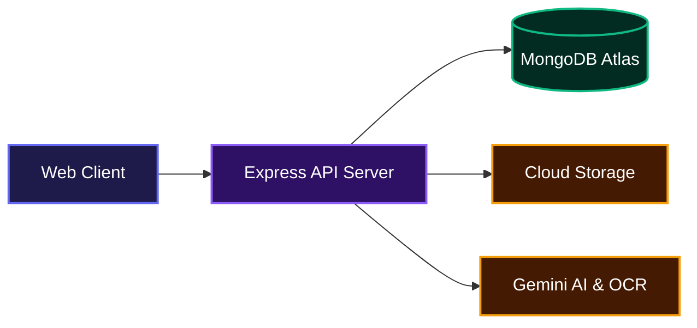

# 🏥 PostVisit: AI-Powered Healthcare Platform

🌐 **Live Demo:** https://postvisit-healthcare.onrender.com

> Upload medical reports. Get AI-powered insights. Track your health. Chat with your doctor's AI.

This project helps teams provide patients with clear, AI-driven explanations of complex medical reports. It processes uploaded documents, extracts crucial health metrics, and builds a comprehensive dashboard so users can easily understand their health data without confusion. No complicated setup, just straightforward functionality that works out of the box.

## System Architecture



---

## ✨ Features

* 🔐 **Authentication System**
  JWT-based authentication with bcrypt hashing, role-based access (user/admin), and secure sessions.

* 📄 **Medical Report Upload**
  Upload PDF and image reports using Cloudinary with secure signed URLs.

  ```mermaid
  sequenceDiagram
    actor User
    participant Server
    participant OCR as "OCR Engine"
    participant AI as "Gemini AI"
    participant DB as "Database"

    User->>Server: Upload medical document
    Server->>OCR: Extract text and values
    OCR-->>Server: Return raw medical data
    Server->>AI: Request risk analysis
    AI-->>Server: Return structured insights
    Server->>DB: Save metrics and analysis
    Server->>User: Trigger completion notification
  ```

* 🤖 **AI-Powered Analysis**
  Integrated with Gemini AI (and intelligent fallback engine) for report summaries, key findings, and personalized recommendations.

* 🔬 **OCR Data Extraction**
  Automatically extracts medical values like Blood sugar, Cholesterol, Hemoglobin, and Blood pressure.

* 📊 **Health Dashboard**
  Interactive charts showing trends over time.

* 💬 **AI Chatbot**
  Context-aware chatbot with session-based history.

  ```mermaid
  sequenceDiagram
    actor User
    participant Server
    participant DB as "Database"
    participant AI as "Gemini AI"

    User->>Server: Send health question
    Server->>DB: Fetch user reports and chat history
    DB-->>Server: Return health context
    Server->>AI: Send prompt with context
    AI-->>Server: Return natural language answer
    Server->>DB: Save chat message
    Server->>User: Display AI response
  ```

* ⚠️ **Risk Prediction Engine**
  Detects risks for Diabetes, Heart disease, Anemia, and Kidney issues.

* 🔔 **Smart Notifications**
  Medication reminders and follow-up alerts.

* 📑 **Export Options**
  PDF health reports and CSV data export.

* 🛡️ **Security Features**
  Helmet.js, rate limiting, input validation, NoSQL injection protection.

* 👨‍💼 **Admin Panel**
  Manage users, monitor activity, view system logs.

* 🌙 **Dark Mode + Responsive UI**
  Fully mobile-friendly design.

---

## 🚀 Live Deployment

The application is deployed on **Render** and can be accessed here:

👉 https://postvisit-healthcare.onrender.com

⚠️ *Note:* Free tier may take 30 to 50 seconds to wake up after inactivity.

---

## ⚙️ Tech Stack

* **Backend:** Node.js, Express.js
* **Database:** MongoDB Atlas
* **Frontend:** EJS, CSS, JavaScript
* **AI Integration:** Google Generative AI (Gemini), OpenAI API (Fallback)
* **File Storage:** Cloudinary
* **Charts:** Chart.js
* **Utilities:** pdfjs-dist, pdfkit, node-cron, nodemailer

---

## 📁 Project Structure

```
postvisit/
├── app.js
├── config/
├── controllers/
├── middleware/
├── models/
├── routes/
├── services/
├── views/
├── public/
└── utils/
```

---

## 🔧 Environment Variables

Create a `.env` file in the root of your project using the following keys:

```env
# ================================
# Server
# ================================
NODE_ENV=development
PORT=3000

# ================================
# MongoDB
# ================================
MONGODB_URI=mongodb://localhost:27017/postvisit

# ================================
# Security & JWT
# ================================
JWT_SECRET=your_super_secret_jwt_key_change_in_production_min_32_chars
JWT_EXPIRE=7d
JWT_COOKIE_EXPIRE=7
BCRYPT_ROUNDS=12
SESSION_SECRET=your_session_secret_key_change_in_production

# ================================
# Cloudinary (for file uploads)
# ================================
CLOUDINARY_CLOUD_NAME=your_cloudinary_cloud_name
CLOUDINARY_API_KEY=your_cloudinary_api_key
CLOUDINARY_API_SECRET=your_cloudinary_api_secret

# ================================
# AI Processing
# ================================
OPENAI_API_KEY=your_openai_api_key
GEMINI_API_KEY=your_gemini_api_key

# ================================
# Email (Nodemailer)
# ================================
EMAIL_HOST=smtp.gmail.com
EMAIL_PORT=587
EMAIL_USER=your_email@gmail.com
EMAIL_PASS=your_app_password
EMAIL_FROM=PostVisit Health <noreply@postvisit.health>

# ================================
# Rate Limiting & App
# ================================
RATE_LIMIT_WINDOW_MS=900000
RATE_LIMIT_MAX=100
APP_NAME=PostVisit
APP_URL=http://localhost:3000
FRONTEND_URL=http://localhost:3000
```

---

## ▶️ Run Locally

```bash
git clone https://github.com/Anas2694/PostVisit-healthcare.git
cd PostVisit-healthcare
npm install
npm run dev
```

To seed the database with mock data:
```bash
npm run seed
```

---

## 🧪 Production Run

```bash
npm start
```

---

## 🔌 API Documentation

Below is a complete reference for the JSON API endpoints exposed by the backend. Most user-facing routes render HTML templates, but the following routes return structured JSON data for asynchronous requests.

### Core API Endpoints

#### Get Health Metrics
Retrieves health data over a specified time window.

**GET** `/api/v1/metrics?days=90`

**Response (200 OK):**
```json
{
  "success": true,
  "data": [
    {
      "_id": "64f1a2b3c4d5e6f7a8b9c0d1",
      "user": "64f1...",
      "date": "2023-09-01T12:00:00.000Z",
      "bloodSugarFasting": 95,
      "source": "report"
    }
  ]
}
```

#### Get Patient Timeline
Fetches a chronological timeline of reports, metrics, and alerts.

**GET** `/api/v1/timeline?days=365`

**Response (200 OK):**
```json
{
  "success": true,
  "data": [
    {
      "type": "report_analyzed",
      "date": "2023-09-01T12:00:00.000Z",
      "title": "Report analyzed: Annual Blood Test",
      "severity": "normal"
    }
  ]
}
```

#### Send AI Chat Message
Sends a user query to the AI chatbot, carrying the session ID and active report context.

**POST** `/chat/message`

**Request Body:**
```json
{
  "message": "What does my fasting blood sugar mean?",
  "sessionId": "b8a9f-31c2-48df-992a-...",
  "reportId": "64f1a2b3c4d5e6f7a8b9c0d1"
}
```

**Response (200 OK):**
```json
{
  "success": true,
  "message": "Your fasting blood sugar is 95 mg/dL, which is perfectly within the normal range.",
  "messageId": "64f1a2b3c4d5e6f7a8b9c0d5",
  "timestamp": "2023-09-01T12:05:00.000Z"
}
```

#### Create Health Goal
Creates a tracking target for a specific medical value.

**POST** `/api/v1/goals`

**Request Body:**
```json
{
  "title": "Lower LDL Cholesterol",
  "metric": "cholesterolLDL",
  "targetOperator": "lte",
  "targetValue": 90,
  "dueDate": "2024-01-01T00:00:00.000Z"
}
```

**Response (201 Created):**
```json
{
  "success": true,
  "data": {
    "_id": "64f1...",
    "title": "Lower LDL Cholesterol",
    "metric": "cholesterolLDL",
    "targetValue": 90
  }
}
```

### Complete HTML & Action Endpoints

* **Auth Routes:**
  * `GET /auth/register`
  * `POST /auth/register`
  * `GET /auth/login`
  * `POST /auth/login`
  * `POST /auth/logout`
  * `GET /auth/forgot-password`
  * `POST /auth/forgot-password`
  * `GET /auth/reset-password/:token`
  * `POST /auth/reset-password/:token`
  * `GET /auth/profile`
  * `PUT /auth/profile`
  * `PUT /auth/change-password`

* **Reports Routes:**
  * `GET /reports`
  * `GET /reports/upload`
  * `POST /reports/upload` (multipart/form-data)
  * `GET /reports/:id`
  * `GET /reports/:id/download` (Returns PDF)
  * `DELETE /reports/:id`
  * `GET /reports/export/csv`
  * `GET /reports/export/health-summary`

* **Dashboard & Notifications:**
  * `GET /dashboard`
  * `GET /dashboard/analytics`
  * `GET /notifications`
  * `POST /notifications/reminder`
  * `POST /notifications/medication`
  * `PUT /notifications/:id/read`
  * `PUT /notifications/read-all`
  * `DELETE /notifications/:id`

* **Admin Routes:**
  * `GET /admin`
  * `GET /admin/users`
  * `PUT /admin/users/:id/toggle`

---

## 🔒 Security

* JWT Authentication
* Password hashing with bcrypt
* Rate limiting
* Helmet.js protection
* Input validation & sanitization

---

## ⚠️ Disclaimer

This application provides **AI-based health insights for educational purposes only** and is **not a substitute for professional medical advice**.

---

## 📄 License

No license file is currently included. Unless a license is added, the repository's source remains under the author's default copyright.

---

## 👨‍💻 Author

**Mohd Viquaruddin Anas**<br>
GitHub: https://github.com/Anas2694

---

⭐ *If you like this project, consider starring the repo!*

[](https://dokugen.samueltuoyo.com)
